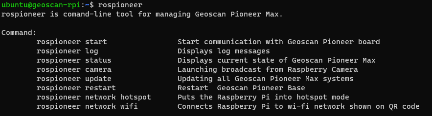

Утилита Rospioneer
===================

Данная утилита командной строки позволяет удобно управлять Пионер Макс.

Введите **rospioneer** в терминале, чтобы увидеть список доступных команд и их краткое описание:

* **rospioneer start**
    Запускает ядро ROS и подключение к базовой плате Геоскан Пионер
* **rospioneer log** 
    Отображение отладочной информации в реальном времени 
* **rospioneer status**
    Отображает текущее состояние Геоскан Пионер Макс
* **rospioneer camera**
    Запуск камеры и веб сервера трансляции изображения
    *(порт по умолчанию: 8088)*
* **rospioneer update**
    Загружает и устанавливает обновления ПО Геоскан Пионер Макс
* **rospioneer restart**
    Перезапуск базовой платы Геоскан Пионер
* **rospioneer network hotspot**
    Переводит Raspberry Pi в режим хот-спота
* **rospioneer network wifi**
    Подключает Raspberry Pi к wi-fi сети по QR-коду