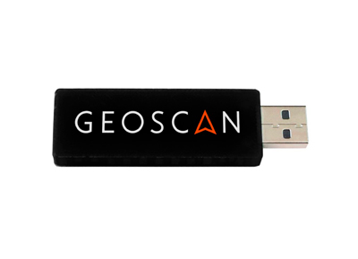
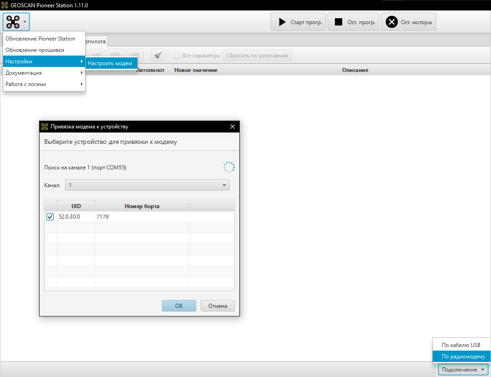

Подключение по USB модему
=========================

USB-модем обеспечивает беспроводное подключение к плате автопилота и позволяет взаимодействовать с ней (смена параметров, загрузка скрипта) без подключения к ПК с помощью USB-кабеля.
Для подключения необходим радиомодем. Его можно подключить в любой свободный USB порт компьютера. Ниже описан алгоритм подключения по радиомодему. 

1)	Подключите аккумулятор к квадрокоптеру.
2)	Подключите радиомодем в USB порт вашего компьютера/ноутбука.
3)	В верхнем меню нажмите на иконку с коптером и выберите опцию "Настройка радиомодема".
4)	В открывшемся окне "Привязка модема к устройству" отображается UID и номер борта доступных устройств. Выберите необходимый вариант установив галочку в первом столбце. Подтвердите действия нажав "Ок".
5)	В правом нижнем углу раскройте меню подключения и выберите вариант "По радиомодему". Дождитесь получения данных об автопилоте и параметрах в Pioneer Station. Статус процесса будет отображаться в верхнем правом углу.

