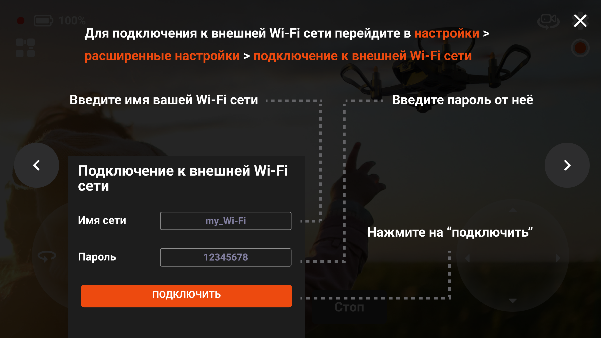

Подключение дрона к wi-fi
=========================

Подключить "Поионер Мини" к внешней wi-fi сети можно через приложение :doc:`Jump </pioneer-mini/flight/geoscan_jump>`, следуя инструкциям, описанным в приложении.

|

После подключения к wi-fi сети ip адрес квадрокоптера можно узнать так же через приложение.