Подготовка к программированию Pioneer Mini на Python
====================================================

Данная страница посвящена общей настройки среды для программирования PyCharm. Здесь описано как установить всё необходимое ПО, подключить проект pioneer_sdk, настроить квадрокоптер для корректной работы с ПК.

Используемое ПО
~~~~~~~~~~~~~~~

Необходимые программы:

* `Pioneer Station 1.11.; <https://dl.geoscan.aero/pioneer/upload/GCS/GEOSCAN_Pioneer_Station.exe>`__
* `PyCharm Community Edition. <https://www.jetbrains.com/ru-ru/pycharm/download/download-thanks.html?platform=windows&code=PCC>`__

Необходимые архивы и ПО для Пионера:

* Скачанный ZIP архив с GitHub;
* Прошивка и параметры для автопилота для Pioneer Mini;
* Актуальная прошивка ESP-32.

Процесс настройки
~~~~~~~~~~~~~~~~~

1.  Для начала необходимо установить среду разработки PyCharm Community

    Ссылка на `загрузку <https://www.jetbrains.com/ru-ru/pycharm/download/download-thanks.html?platform=windows&code=PCC>`__ PyCharm Community Edition.

2. Далее необходимо скачать ZIP архив с библиотекой для Pioneer Mini с GitHub.

`Ссылка на архив pioneer_sdk <https://github.com/geoscan/pioneer_sdk>`__

|image2|\ |image1|

3. Данный архив необходимо распаковать в заранее созданную папку.
   Сделайте это в удобной для вас директории.

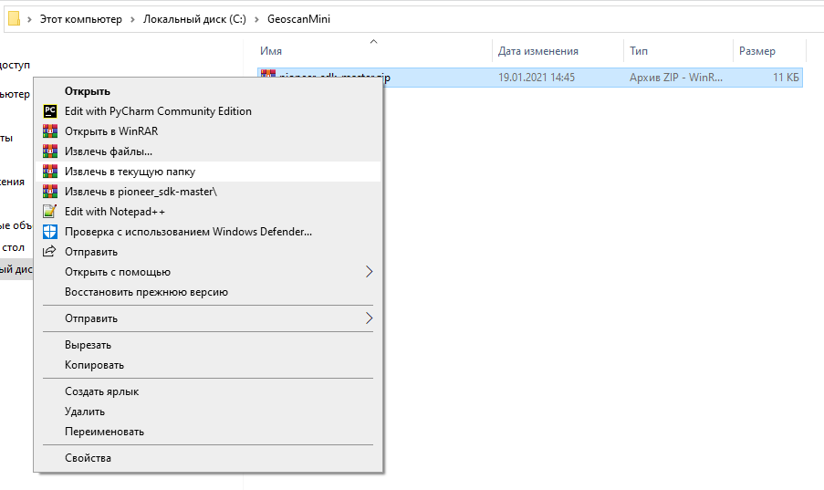

4. Запускаем PyCharm и нажимаем кнопку “Open”, в качестве
   открываемой папки выбираем ранее распакованный архив.

.. figure:: media/image5.png
   :align: center

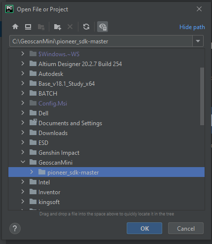

Ожидаем пока PyCharm создаст и настроит виртуальную среду. Это можно отследить по полоске прогресса в нижнем правом углу программы.

5. Чтобы коптер мог выполнять Python скрипты на нём должна быть установлена следующая прошивка “АП_mavlink.bin” и поставлены параметры “mavlink_param.properties”.

1) Ссылка на скачивание актуальных файлов:

Актуальное ПО на странице :doc:`../../downloads/software-d`

2) Как установить прошивку АП на Пионер Мини:

`Обновление прошивки автопилота <https://pioneer-doc.readthedocs.io/ru/master/instructions/pioneer-mini/settings/firmware_upgrade.html>`__

3) Если прошивка ESP32 устарела, то её необходимо обновить:

`Обновление прошивки ESP32 <https://pioneer-doc.readthedocs.io/ru/master/instructions/pioneer-mini/settings/esp32-update.html>`__

4) Как обновить параметры:

`Загрузка параметров АП <https://pioneer-doc.readthedocs.io/ru/master/instructions/pioneer-mini/settings/autopilot\_parameters.html>`__

6. Далее в актуальных параметрах автопилота необходимо изменить значение uMux с «1» на «3», тем самым коптер перейдёт из режима управления с телефона в режим выполнения python-скриптов.

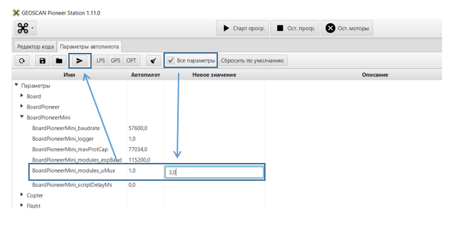

.. attention:: Переключите параметр uMux в "1", если снова хотите использовать приложение Geoscan Jump.

7.  Включаем Pioneer Mini и подключаемся к нему по Wi-Fi. Имя сети каждого коптера уникально! Но пароль у всех одинаковый: «12345678».

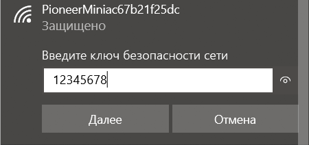

.. attention:: Обратите внимание, профиль сети в настройках Windows должен быть **«частным»**, а не
               общественным. В противном случае передача данных между устройствами
               не будет работать должным образом!

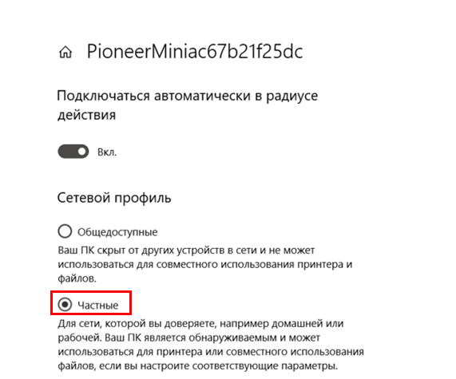

.. attention:: Также для данной сети необходимо отключить Брандмауэр Windows!

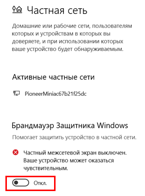

8. Пример запуска скрипта

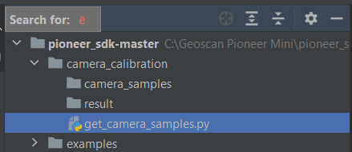

Теперь коптер готов выполнять скрипты, самое время разобраться как их запускать! Первым делом необходимо произвести калибровку камеры нашего квадрокоптера. Для этого в PyCharm необходимо открыть скрипт «get\_camera\_samples.py».

9. Скрипт необходимо добавить в список конфигураций, который находится в правом верхнем углу.

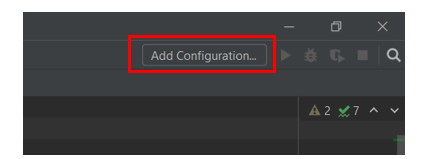

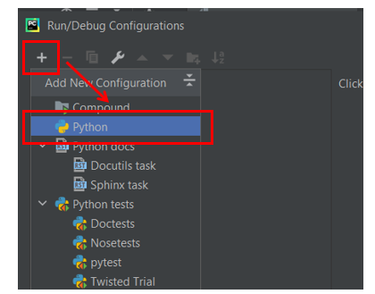

Здесь необходимо указать путь к скрипту.

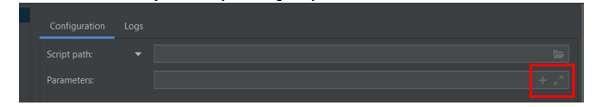

10. После того, как в списке появился выбранный скрипт, можно нажимать кнопку старт.

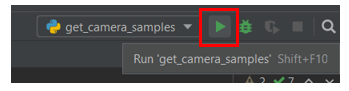

.. attention:: Внимательно смотрите за тем, какой скрипт у вас выбран в списке. Запускаемый код не всегда соответствует открытому в текущий момент коду.

11. Для калибровки камеры необходимо распечатать специальное изображение на листе А4. В процессе работы программы необходимо сделать 15 снимков листа. Снимки делаются на кнопку «P» на клавиатуре. По завершению выполнения программы в терминале появится сообщение об успешном завершении калибровки. А в папке проекта "result" появятся полученные фотографии (матрица камеры).

*  `Ссылка на скачивание изображения для калибровки камеры <https://raw.githubusercontent.com/opencv/opencv/master/doc/pattern.png>`__

*  :download:`Ссылка на скачивание aruco-маркера для скрипта aruco-flight <files/PioneerSDK-aruco.pdf>`

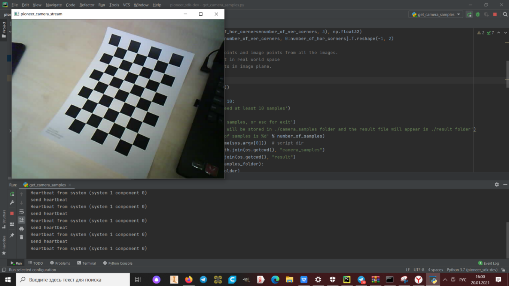

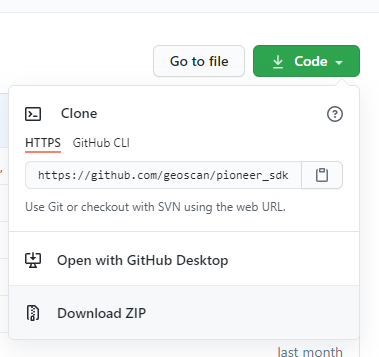
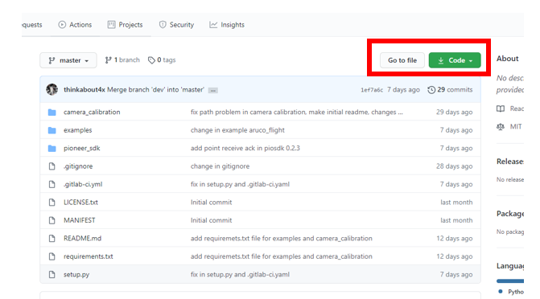

.. |image4| image:: media/image5.png
   :width: 5.77083in
   :height: 4.29167in

