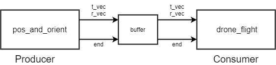
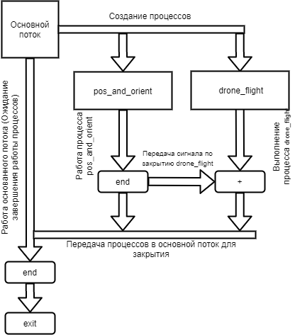
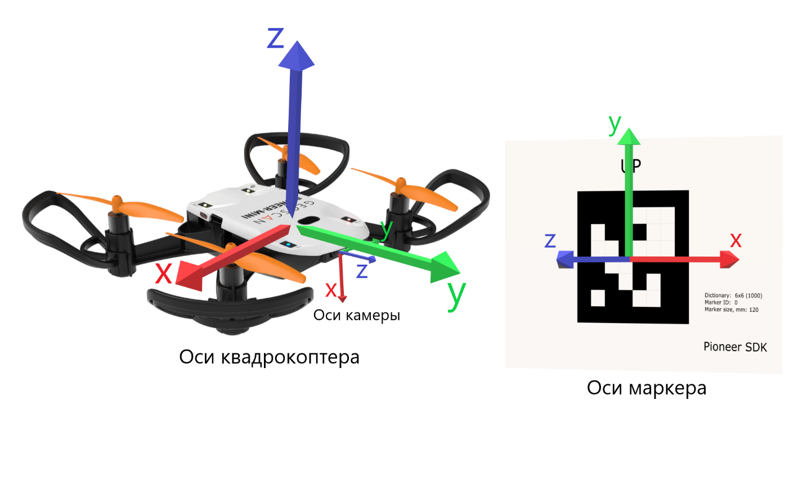

Скрипт Aruco_Flight
===================

Скрипт Aruco_flight служит для изучения в Python: многопроцессорности, работы с буфером данных, функции распознавания Aruco-маркеров и работы с
ними, а также с библиотекой pioneer_sdk. Перед выполнением скрипта необходимо произвести калибровку камеры в скрипте get_camera_samples: https://github.com/geoscan/pioneer_sdk/tree/master/camera_calibration

Как работает алгоритм?
----------------------

Для корректной работы одновременного отслеживания маркера и перемещения
дрона необходимо разделить две эти задачи на два отдельных процесса. В
основном потоке создаём 2 параллельных процесса, которые общаются между
собой через буфер. Один процесс отвечает за обнаружение маркера и чтение
необходимой информации, а другой за перемещение квадрокоптера.
Процесс **pos_and_orient** – отвечает за работу с маркером а
**drone_flight** – за управление квадрокоптером.

    Рисунок 1 - Принципиальная схема работы алгоритма

При нажатии клавиши Escape, которое отлеживается в Producer процессе,
буфер закрывается, следовательно завершается обмен данными и коптер
заходит на посадку.

    Рисунок 2 - Распределение потоков

Расчётная часть алгоритма.
--------------------------

Для следования квадрокоптера за маркером необходимо учитывать несколько
систем координат: от начальной точки взлёта, текущее положение
квадрокоптера, положение камеры, положение самого маркера, а также
проекция от него, чтобы держаться на определённом растяни от маркера.

    Рисунок 3 - Оси квадрокоптера и маркера

+----------------------------------------------------------------------+
| x_camera = t_vec.item(0)                                             |
+----------------------------------------------------------------------+
| y_camera = t_vec.item(1)                                             |
+----------------------------------------------------------------------+
| z_camera = t_vec.item(2)                                             |
+----------------------------------------------------------------------+
| yaw_camera = math.radians(r_vec_euler.item(1))                       |
+----------------------------------------------------------------------+
| c_yaw_prev = math.cos(command_yaw)                                   |
+----------------------------------------------------------------------+
| s_yaw_prev = math.sin(command_yaw)                                   |
+----------------------------------------------------------------------+
| command_yaw -= k_p_yaw \* yaw_camera                                 |
+----------------------------------------------------------------------+
| c_yaw_comm = math.cos(command_yaw)                                   |
+----------------------------------------------------------------------+
| s_yaw_comm = math.sin(command_yaw)                                   |
+----------------------------------------------------------------------+
| command_x +=                                                         |
| k_p_xy*(x_camera*c_yaw_prev-z_camera*s_yaw_prev+distance*s_yaw_comm) |
+----------------------------------------------------------------------+
| command_y += k_p_xy*(x_camera \* s_yaw_prev + z_camera \* c_yaw_prev |
| - distance \* c_yaw_comm)                                            |
+----------------------------------------------------------------------+

Разбор скрипта
--------------

1. Импортируем необходимые библиотеки и определяем их назначение:

  .. code-block:: python

      from pioneer_sdk import Pioneer
      import os
      import sys
      import math
      import cv2
      import cv2.aruco as aruco
      import numpy as np
      import yaml
      import multiprocessing as mp
      from multiprocessing.managers import BaseManager

  -  | **Pioneer_sdk** – библиотека для управления квадрокоптером;
     | Описание библиотеки Pioneer_sdk - https://pioneer-doc.readthedocs.io/ru/master/programming/python/pioneer-sdk-methods.html;

  -  | **NumPy** – библиотека для работы с массивами данных;
     | Описание библиотеки NumPy - https://numpy.org/doc/stable/;

  -  | **Cv2** – библиотека машинного зрения;
     | Описание библиотеки OpenCV - https://docs.opencv.org/master/index.html;

  -  | **sys** – библиотека, которая обеспечивает доступ к некоторым переменным и функциям, взаимодействующим с интерпретатором python;
     | Описание библиотеки sys - https://docs.python.org/3/library/sys.html;

  -  | **os** – библиотека, которая предоставляет множество функций для работы с операционной системой;
     | Описание библиотеки os - https://docs.python.org/3/library/os.html;

  -  | **yaml** – библиотека для работы с форматом данных yaml;
     | Описание библиотеки yaml - https://pyyaml.org/wiki/PyYAMLDocumentation;

  -  | **multiprocessing** – библиотека для параллельной обработки данных на разных ядрах процессора в Python;
     | Описание библиотеки multiprocessing - https://docs.python.org/3/library/multiprocessing.html;

2. Создаём функцию image_proc(buff, drone, camera_mtx, camera_dist) в которой будем получать изображение и искать на нём Aruco-маркеры:

  .. code-block:: python

      def image_proc(buff, drone, camera_mtx, camera_dist):

3. Для работы с модулем OpenCV по определению Aruco-маркеров создадим следующие переменные:

  - **size_of_marker** – указываем длину сторон маркера в метрах.
  - **aruco_dict** – тип маркеров.
  - **aruco_parametrs** – параметры обнаружения.

  .. code-block:: python

    size_of_marker = 0.12  # side length in meters
    aruco_dict = aruco.Dictionary_get(aruco.DICT_6X6_1000)
    aruco_parameters = aruco.DetectorParameters_create()

  В бесконечном цикле будем определять и выделять маркер на изображении:

  .. code-block:: python

    while True:
      try:

4. В переменную camera_frame передаём изображение от квадрокоптера:

  - | **cv2.imdecode(buf, flag)** – чтение изображения из указного массива, где:
    | *buf* – читаемый массив;
    | *flag* – тип изображения.

  - | **np.frombuffer(buffer,dtype)** - интерпретирует буфер как одномерный массив, где:
    | *buffer* - буфер-подобный объект;
    | *dtype* - тип данных NumPy.

  - | **pioneer_sdk.get_raw_video_frame()** – возвращает массив байт представляющий собой jpg картинку.

  Выходит, следующая строчка:

  .. code-block:: python

    camera_frame = cv2.imdecode(np.frombuffer(drone.get_raw_video_frame(), dtype=np.uint8), cv2.IMREAD_COLOR)

5. Переводим изображение в чёрно белый формат. Создаём маску.

  .. code-block:: python

    gray = cv2.cvtColor(camera_frame, cv2.COLOR_BGR2GRAY)

  И возвращаем 3 значение из метода обнаружения маркеров **aruco.detectMarkers(gray, aruco_dict, patameters=aruco_parameters)**, где:

  | *corners* – углы; 
  | *ids* – номер маркера;
  | *rejected_ing_points* – наличие лишних тэгов.

  .. code-block:: python

     corners, ids, rejected_img_points = aruco.detectMarkers(gray, aruco_dict, parameters=aruco_parameters)

6. Условием **if np.all(ids is not None):** проверяем есть ли в аргументе ids элементы в значении True, т.е. видим ли мы тэг:

  .. code-block:: python

    if np.all(ids is not None):

7. Получаем оси системы координат, связанной с центром маркера, и выводим их в две переменные: **r_vec_rodrigues** и **t_vec**

  .. code-block:: python

    r_vec_rodrigues, t_vec, _ = aruco.estimatePoseSingleMarkers(corners, size_of_marker, camera_mtx,camera_dist)

8. Рисуем на изображении полученные оси системы координат, связанной с центром маркера и обводим маркер:

  .. code-block:: python

    aruco.drawAxis(camera_frame, camera_mtx, camera_dist, r_vec_rodrigues, t_vec, 0.01)
    aruco.drawDetectedMarkers(camera_frame, corners)

9. Приводим полученный вектор ориентации к вектору углов Эйлера:

  .. code-block:: python

    r_mat = cv2.Rodrigues(r_vec_rodrigues)[0]
    p = np.hstack((r_mat.reshape(3, 3), t_vec.reshape(3, 1)))
    r_vec_euler = cv2.decomposeProjectionMatrix(p)[6]

10. Так как очередь используется из одного элемента, то мы проверяем ее на заполненность, если да, то стираем старый элемент и записываем
    новый:

  .. code-block:: python

    if buff.full():
    buff.get()
    buff.put([t_vec, r_vec_euler])

11. Если обнаружения тэга не происходит, то просто продолжаем выполнение процесса:

  .. code-block:: python

    except cv2.error:
      continue

12. Выводим изображение:

  .. code-block:: python

    cv2.imshow('marker_detection', camera_frame)

13. Создаём обработку нажатия клавиш и нажатии на Esc закрываем окно с изображением, закрываем буфер аргументом ‘end’ и выходим из функции.

  .. code-block:: python

    key = cv2.waitKey(1)

    if key == 27:  # esc
        print('esc pressed')
        cv2.destroyAllWindows()
        if buff.full():
            buff.get()
        buff.put(['end'])
        break

14. Создаём функцию перемещения квадрокоптера и ряд переменных:

  .. code-block:: python

    def drone_control(buff, drone):
      command_x = float(0)
      command_y = float(0)
      command_z = float(1)  # initial flight height
      command_yaw = math.radians(float(0))

      k_p_xy = 0.6
      k_p_z = 0.6
      k_p_yaw = 0.4
      distance = 0.5

      t_vec = None
      r_vec_euler = None

      new_point = True
      new_message = True

      p_r = False

15. Далее запускаем бесконечный цикл, в котором задаём ряд условий.

  .. code-block:: python

    while True:

16. Если получаем новую точку или новое сообщение, то перемещаемся в
    актуальные точки и сбрасываем флаги.

  .. code-block:: python

    if new_point and new_message:
      drone.go_to_local_point(x=command_x, y=command_y, z=command_z, yaw=command_yaw)
      new_point = False
      new_message = False

17. Если в буфере есть какое-либо значение, то получаем его. Если длинна сообщения 1 и его содержимое ‘end’, то завершаем процесс. В
    противном случае переменой **t_vec** и **r_vec_euler** присваиваем матрицы получение из буфера. Выставляем флаг **new_massage**.

  .. code-block:: python

    if not buff.empty():
      message = buff.get()
      if len(message) == 1 and message[0] == 'end':
          break
      t_vec = message[0]
      r_vec_euler = message[1]
      new_message = True

18. Если достигнута точка, то выставляем флаг на перерасчёт координат.

  .. code-block:: python
  
    if drone.point_reached():
      p_r = True

19. Если сработал флаг на перерасчёт координат и **t_vec** с **t_vec_euler** не пустые, то происходит расчёт координат:

  .. code-block:: python
  
    if p_r and t_vec is not None and r_vec_euler is not None:
      x_camera = t_vec.item(0)
      y_camera = t_vec.item(1)
      z_camera = t_vec.item(2)
      yaw_camera = math.radians(r_vec_euler.item(1))
      c_yaw_prev = math.cos(command_yaw)
      s_yaw_prev = math.sin(command_yaw)
      command_yaw -= k_p_yaw * yaw_camera
      c_yaw_comm = math.cos(command_yaw)
      s_yaw_comm = math.sin(command_yaw)
      command_x += k_p_xy*(x_camera*c_yaw_prev-z_camera*s_yaw_prev+distance*s_yaw_comm)
      command_y += k_p_xy*(x_camera * s_yaw_prev + z_camera * c_yaw_prev - distance * c_yaw_comm)
      command_z -= k_p_z * y_camera
      new_point = True
      p_r = False

20. Далее используем конструкцию **if \__name_\_ == '__main__':**, которая является точкой входа в программу, и сообщаем о запуске скрипта. Всё, что идёт до этого условия, выполнятся всегда: и при вызове в качестве модуля и при вызове, как исполняемый файл.

  .. code-block:: python
  
    if __name__ == '__main__':
      print('start')

  | Подробное описание данной конструкции: https://docs.python.org/3/library/__main__.html

21. Внутри конструкции **try** загружаем калибровочный файл **yaml**, заранее
    созданный в скрипте **get_camera_samples**.

  .. code-block:: python
  
    try:
      # change if calibration_matrix.yaml file is located in not default location
      calibration_file = open(os.path.join(os.getcwd(), '..', "camera_calibration", "result", "calibration_matrix.yaml"))
      parsed_calibration_file = yaml.load(calibration_file, Loader=yaml.FullLoader)
      mtx = np.array(parsed_calibration_file.get("camera_matrix"))
      dist = np.array(parsed_calibration_file.get("dist_coeff"))

22. Если калибровочного файла нет, то пишем о необходимости произвести калибровку и завершаем выполнение скрипта:

  .. code-block:: python
  
    except FileNotFoundError:
      print('Сan not find calibration data, please run get_camera_samples.py script from camera calibration folder')
      sys.exit(0)

23. Необходимо воспользоваться конструкцией **manager**, т.к. просто экземпляр класса нельзя передавать в буфере. Помимо этого, запускаем
    моторы и взлетаем.

  .. code-block:: python
  
    BaseManager.register('Pioneer', Pioneer)
    manager = BaseManager()
    manager.start()
    pioneer_mini = manager.Pioneer()
    pioneer_mini.arm()
    pioneer_mini.takeoff()

24. Создаём буфер обмена данными и мульти процессы, исполнительными функциями которых являются ранее созданные image_proc и drone_control запускам их.

  .. code-block:: python
  
    buffer = mp.Queue(maxsize=1)
    pos_and_orient = mp.Process(target=image_proc, args=(buffer, pioneer_mini, mtx, dist))
    drone_flight = mp.Process(target=drone_control, args=(buffer, pioneer_mini))
    pos_and_orient.start()
    drone_flight.start()

25. Как только выполнение процессов завершено, то они прикрепляются обратно к основному потоку для их корректного закрытия:

  .. code-block:: python
  
    pos_and_orient.join()
    drone_flight.join()
  
    pioneer_mini.land()

Вопросы для самостоятельного разбора.
~~~~~~~~~~~~~~~~~~~~~~~~~~~~~~~~~~~~~

| 1) Как можно улучшить поворот за тегом?
| 2) Дописать алгоритм так, чтобы можно было отслеживать маркер независимо от его ориентации.
| 3) Если два маркера, отслеживать один – ближайший.
| 4) Дописать алгоритм так, чтобы коптер отслеживал строго определенный маркер из словаря. (например (aruco.DICT_6X6_1000))
| 5) Дописать алгоритм так, чтобы можно отслеживать два маркера и производить конкретные действия для каждого маркера.
| 6) Дописать алгоритм, чтобы коптер совершал индикацию светодиодами в зависимости от маркера который он видит.
| 7) Дописать алгоритм, чтобы коптер производил посадку на маркер.